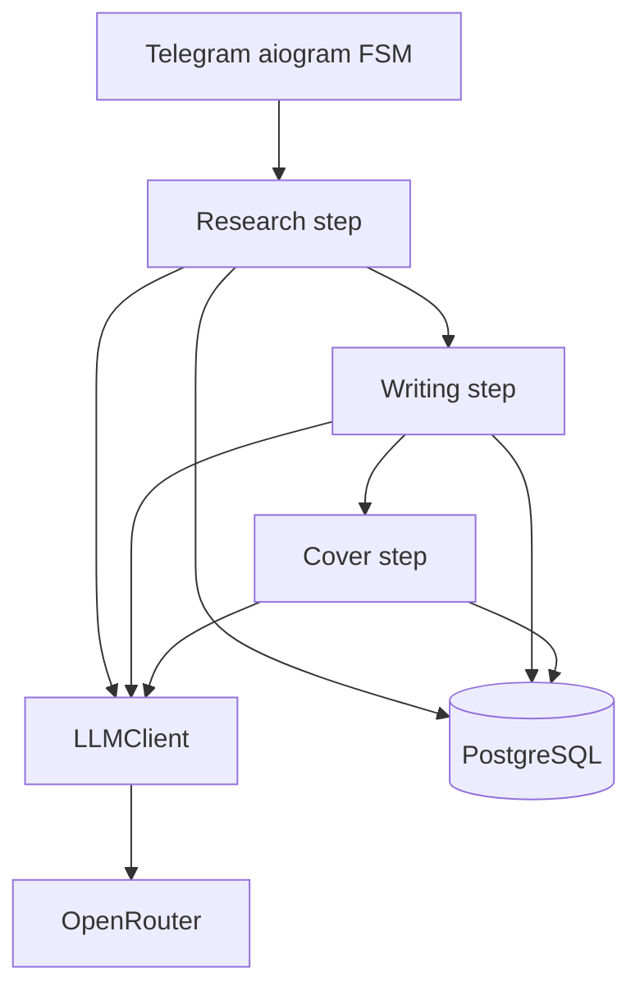

# AI stack — what runs underneath Q6

Grill Q6: **in-process pipeline steps** (agreed).  
This doc answers: *what software actually calls the model?*

**Model ids:** `.planning/MODEL-MATRIX.md` (research / writing / cover + fallbacks).

## Three layers (do not conflate)

| Layer | Example | Role in this bot |
|-------|---------|------------------|
| **Model** | `anthropic/claude-sonnet-4`, `nousresearch/hermes-3-…` on OpenRouter | Intelligence; swap via config without code changes |
| **LLM transport** | OpenRouter, OpenAI, Anthropic API | HTTP `chat/completions` + optional JSON schema |
| **Agent harness** | Claude Code, Cursor agent, OpenClaw `sessions_spawn` | **Not** in production path — local/dev or different product |

**Hermes** → pick as a **model id** on OpenRouter if you want that flavor, not a replacement for the bot backend.

**Claude Code / Cursor agent** → use while **building** the repo; never invoke per Creator message in Telegram (no stable multi-tenant API, wrong economics).

## Recommended v1 architecture

### Pipeline steps (your code — not Discord agents)

| Step | When | Output |
|------|------|--------|
| **Research** | Session flag `web_research=true` | **Research brief** |
| **Writing** | Every draft round | 3 **draft options** (JSON) |
| **Cover** | Session flag `cover_generation=true` | Image file |

Writing step = one structured LLM call per **draft round** (refinement uses same models).

Cover step = image API (may differ from `chat/completions`).

### Draft round (writing step)

1. Load personality profile + session inputs + research brief + prior rounds.
2. `LLM_MODEL_DRAFT` → fallback on retry.
3. Persist `draft_rounds`; return inline keyboard.

### LLMClient

- OpenAI-compatible client (`httpx` or `openai` SDK).
- Base URL: `https://openrouter.ai/api/v1` (or direct provider).
- Env: `OPENROUTER_API_KEY`, `LLM_MODEL_DRAFT`, `LLM_MODEL_FAST` (optional).
- Retries, timeout, token logging per Creator.

### When to add a worker

If round latency **> ~25s** (Telegram UX), enqueue job → worker runs same orchestrator → bot edits “still drafting…” message. Same LLM stack; only execution moves off the polling process.

## What we are not doing in v1

| Approach | Why not |
|----------|---------|
| OpenClaw subagents per round | Discord-shaped; 3× calls + orchestration tax |
| LangChain/LlamaIndex as core | YAGNI until tool-use/RAG is required |
| Claude Code subprocess per `/new` | Not a service |
| Local-only Ollama | Ops burden unless you explicitly want air-gap |

## Resolved product inputs

- **Web research:** required capability in v1 (implementation: grill Q7).
- **Cover generation:** optional per session at `/new`.
- **Token cap:** nice-to-have.
- **Locales:** `en`, `ru` — see `.planning/I18N.md`.

## Config sketch

See `.planning/MODEL-MATRIX.md` for full env list (`LLM_MODEL_RESEARCH`, `LLM_MODEL_DRAFT`, `LLM_MODEL_IMAGE`, fallbacks).
