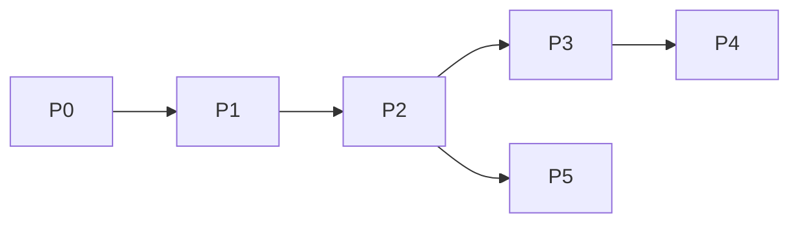

# Roadmap — phased

## Phase 0 — Scaffold ✅ (this session)

- Planning docs, CONTEXT, ADRs, package skeleton, docker-compose postgres

## Phase 0.5 — Worker (v1 requirement)

- Redis + worker process (research, writing, review, cover, publish jobs)
- Bot enqueues jobs, progress messages, result handlers

## Phase 1 — Gate + onboarding grill

- Allowlist middleware
- Onboarding FSM (grill-me sequential), `questions.yaml`, `profile_answers`
- `/start`, `/onboarding`, `/profile` (view/edit answers), `/settings`, `/help`, `/cancel`

## Phase 2 — Content session core

- `/new`, `/sessions`, resume
- Text input, draft rounds, confirm
- Session titles, state machine

## Phase 3 — Multimodal

- Image download + vision context
- Voice → STT → text input

## Phase 4 — Publish (v1 = all providers)

- Telegram channel connection + post
- Instagram OAuth (Meta Graph) + publish
- LinkedIn OAuth + publish
- Partial-failure retry per provider

## Phase 5 — OpenClaw parity (optional)

- `/research` trend brief
- Scheduled daily push

## Dependencies

