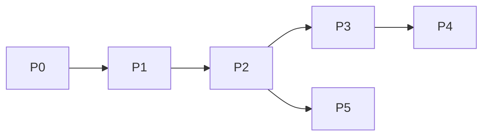

# Roadmap — phased

## Phase 0 — Scaffold ✅ (this session)

- Planning docs, CONTEXT, ADRs, package skeleton, docker-compose postgres

## Phase 0.5 — Worker (v1 requirement) 🟡

- [x] Redis + `JobQueue` + `cfbot-worker`
- [x] Worker handles `draft_round` jobs
- [ ] Bot progress + notify when `USE_WORKER=true`

## Phase 1 — Gate + onboarding grill ✅

- [x] Allowlist middleware (DB)
- [x] Onboarding FSM, `questions.yaml` (14), `profile_answers`
- [x] `/start`, `/onboarding`, `/profile`, `/settings`, `/help`
- [ ] `/cancel` FSM cleanup (stub only)

## Phase 2 — Content session core ✅

- [x] `/new` setup (research/cover toggles)
- [x] Session input → draft rounds
- [x] `/sessions`, resume
- [x] Confirm + follow-up menu (original brief)
- [x] Session titles (first line of input)

## Phase 3 — Multimodal 🟡

- [x] Image/voice input saved to `session_inputs`
- [ ] Image download + vision context
- [ ] Voice → STT → text input

## Phase 4 — Publish (v1 = all providers) 🟡

- [x] Publish orchestrator + `published_artifacts`
- [x] OAuth callbacks store stub tokens
- [ ] Telegram channel connection + post
- [ ] Instagram Graph publish
- [ ] LinkedIn publish
- [ ] Partial-failure retry per provider

## Phase 5 — OpenClaw parity (optional)

- `/research` trend brief
- Scheduled daily push

## Dependencies

