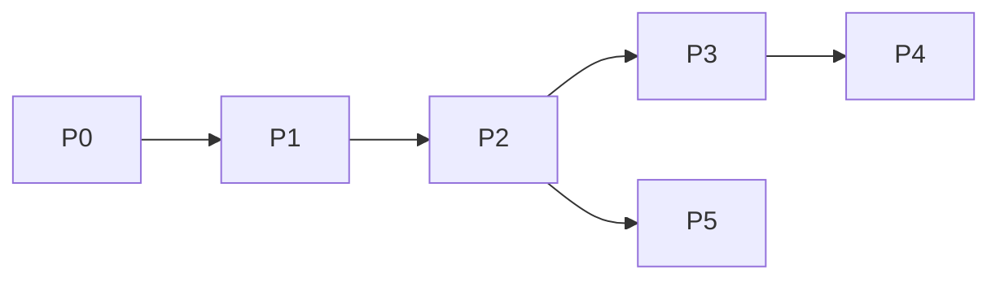

# Roadmap — phased

## Phase 0 — Scaffold ✅ (this session)

- Planning docs, CONTEXT, ADRs, package skeleton, docker-compose postgres

## Phase 0.5 — Worker (v1 requirement) 🟡

- [x] Redis + `JobQueue` + `cfbot-worker`
- [ ] Bot enqueues jobs, progress messages, result handlers

## Phase 1 — Gate + onboarding grill ✅

- [x] Allowlist middleware (DB)
- [x] Onboarding FSM, `questions.yaml` (14), `profile_answers`
- [x] `/start`, `/onboarding`, `/profile`, `/settings`, `/help`
- [ ] `/cancel` FSM cleanup (stub only)

## Phase 2 — Content session core 🟡

- [x] `/new` setup (research/cover toggles)
- [ ] Session input → draft rounds
- [ ] `/sessions`, resume
- [ ] Confirm + follow-up menu (original brief)
- [ ] Session titles

## Phase 3 — Multimodal

- Image download + vision context
- Voice → STT → text input

## Phase 4 — Publish (v1 = all providers)

- Telegram channel connection + post
- Instagram OAuth (Meta Graph) + publish
- LinkedIn OAuth + publish
- Partial-failure retry per provider

## Phase 5 — OpenClaw parity (optional)

- `/research` trend brief
- Scheduled daily push

## Dependencies

