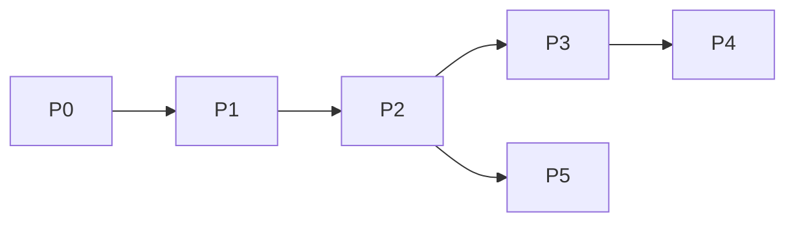

# Roadmap — phased

## Phase 0 — Scaffold ✅ (this session)

- Planning docs, CONTEXT, ADRs, package skeleton, docker-compose postgres

## Phase 0.5 — Worker (v1 requirement) ✅

- [x] Redis + `JobQueue` + `cfbot-worker`
- [x] Worker handles `draft_round` jobs
- [x] Bot polls session + sends draft keyboard when `USE_WORKER=true`

## Phase 1 — Gate + onboarding grill ✅

- [x] Allowlist middleware (DB)
- [x] Onboarding FSM, `questions.yaml` (14), `profile_answers`
- [x] `/start`, `/onboarding`, `/profile`, `/settings`, `/help`
- [x] `/cancel` FSM + active session cleanup

## Phase 2 — Content session core ✅

- [x] `/new` setup (research/cover toggles)
- [x] Session input → draft rounds
- [x] `/sessions`, resume
- [x] Confirm + follow-up menu (original brief)
- [x] Session titles (first line of input)

## Phase 3 — Multimodal ✅

- [x] Image/voice input saved to `session_inputs`
- [x] Image download + vision context (`describe_image`)
- [x] Voice → STT → text input (`transcribe_audio`)

## Phase 4 — Publish (v1 = all providers) ✅

- [x] Publish orchestrator + `published_artifacts`
- [x] OAuth callbacks store tokens (encrypted when `CREDENTIALS_ENCRYPTION_KEY` set)
- [x] Telegram channel connection (forward post) + publish adapter
- [x] Instagram Graph adapter (live when token valid, stub otherwise)
- [x] LinkedIn UGC adapter (live when token valid, stub otherwise)
- [x] Partial-failure retry per provider (one retry)

## Phase 5 — OpenClaw parity (optional — skipped)

- `/research` trend brief
- Scheduled daily push

## Dependencies

