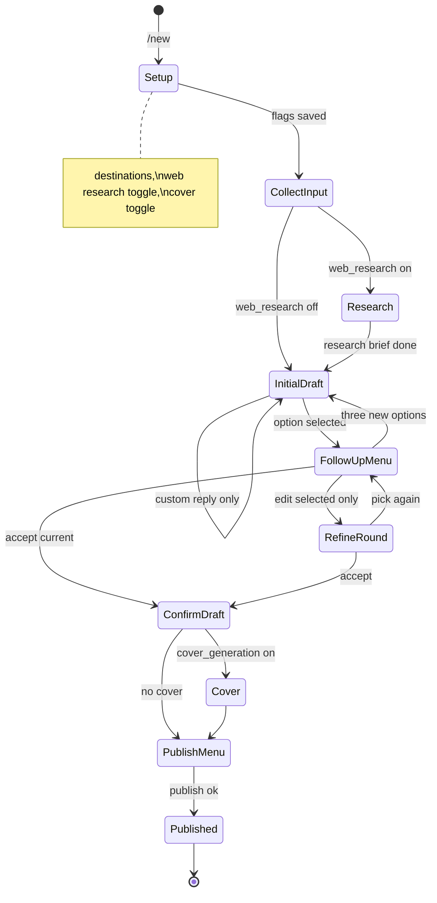

# Functional specification — Telegram Content Factory Bot

Source: user brief + [content-factory.md](https://github.com/hesamsheikh/awesome-openclaw-usecases/blob/main/usecases/content-factory.md).

## 1. Access control

| Rule | Behavior |
|------|----------|
| Allowlist | Only Telegram user ids on an operator-maintained list may use any command |
| Rejection | Non-allowlisted users get a single explanation message; no data stored |

## 2. Onboarding (personality grill — grill-me style)

| Step | Behavior |
|------|----------|
| Trigger | First `/start` without ready profile; `/onboarding` to re-run (blocked if active content session) |
| UI locale | Before onboarding: `LocaleMiddleware` maps Telegram `language_code` → `ru` if `ru`/`rus`/`ru-*`, else `en`. Allowlist errors use same locale. First `/start` seeds `creators.primary_language` |
| Style | **One question at a time** (grill-me); not a long questionnaire — see `.planning/ONBOARDING-QUESTIONS.md` + `onboarding/questions.yaml` |
| UI | Per question: show **recommended** option (⭐), two alternatives, 4th **custom reply**; recommendation line in chat |
| Count | **14 questions** (`onboarding/questions.yaml`) |
| Topics | Language, occupation, goals, audience, tone, formats, niche, taboos, signature themes, personal angle, human design, cadence, **web research** on/off, **review step** on/off |
| Persistence | Each answer in `profile_answers`; assembled into **personality profile** for writing/review |
| Research preference | `web_research` → `creators.research_default_enabled` (default **on**); `/new` still offers per-session override |
| Review preference | `review_agent` → `creators.review_enabled` (default **on**) |
| Completion | `personality_profile.ready = true` → unlocks `/new` |
| Edit later | `/profile` lists answers; tap one → re-ask that question only (same 3+1 UI); `/settings` for language |

**Goal:** Content must feel **individual and personal** — enough signal for the **writing step** to draft as the Creator, not a generic influencer bot.

## 3. Provider connections (v1 — all required)

**Scope decision (grill Q2):** v1 must ship publish paths for **Telegram, Instagram, and LinkedIn**. No feature-flag deferral.

| Provider | Connection mechanism | Publish target |
|----------|---------------------|----------------|
| Telegram | Bot added as admin to channel/group; store `chat_id` | Channel post |
| Instagram | Meta Graph API OAuth via hosted web callback (Business/Creator account) | Feed / Reels per approved scopes |
| LinkedIn | LinkedIn OAuth via hosted web callback | Member or organization post |

Command surface: `/providers` — list status, connect, disconnect.

**Prerequisites (non-code):** Meta app + LinkedIn developer app submitted for review; test users during development.

**OAuth UX (grill Q3):** `/providers` → URL button → `{PUBLIC_BASE_URL}/oauth/{instagram|linkedin}/start` (signed) → provider OAuth → callback stores tokens. Setup checklist: `.planning/OAUTH-SETUP.md`.

## 4. Content session (`/new`)

**Research topic (gap closure):** Sonar runs **after** the Creator supplies session input (text and/or transcribed audio and/or image context). The **research brief** is grounded on that input plus **personality profile**, not generic niche-only trends.

| Phase | Behavior |
|-------|----------|
| Start | `/new` **setup** (before input): (1) **where to post**, (2) **web research** on/off (default from onboarding `research_default_enabled`), (3) **cover / thumbnail** on/off (**default off**) |
| Input | Creator sends text, images, voice/audio (transcribed) |
| Research | If enabled at setup: run Sonar **after input** → **research brief** (topic = input + profile, gap G2/A) |
| Review | If `review_enabled`: worker runs **review step** on draft JSON → short critique in chat, then menus |
| First drafts | **Initial draft menu** (3 options + custom reply) |
| Cover | If enabled: after final draft confirmed, before publish (image models in matrix) |
| Storage | Session row with **title** (auto from first line or explicit prompt) |
| Initial draft menu | 3 **draft options** + **custom reply** (original brief) |
| Follow-up menu | After selecting an option (or feedback): buttons for **three new options**, **edit selected only**, **confirm this draft**, + **custom reply** |
| Three new options | New **draft round** → 3 fresh options (initial-style menu again) |
| Edit selected only | **Refinement mode** (Q4=A): 1 edited + 2 new + custom reply → back to follow-up menu |
| Confirm | Creator confirms final draft from follow-up menu (or after refinement accept) |
| v1 publish gate | All three **providers** must be publishable in production (user gap #1) — no Telegram-only shippable milestone |
| Publish | Offer all connected providers or subset chosen at session start |
| Complete | Return urls per **published artifact**; session `closed` |
| Next | New work requires new `/new` |

## 5. Session management

| Command | Behavior |
|---------|----------|
| `/sessions` | Paginated inline list by **session title** |
| Resume | Selecting a session restores FSM state (`drafting`, `awaiting_publish`, …) |
| Concurrency | One **active** session per Creator (grill Q5=A); `/new` conflicts → resume / close / cancel |

## 6. Mapping from OpenClaw Content Factory

| OpenClaw concept | Telegram bot equivalent |
|------------------|-------------------------|
| Research Agent (#research) | Sonar **research step** after session input when `web_research` on |
| Writing Agent (#scripts) | Initial draft menu + follow-up / refinement **draft rounds** |
| Thumbnail Agent (#thumbnails) | Optional **cover step** per session flag |
| Discord channels | Session title + DB state, not separate chats |
| Scheduled 8 AM pipeline | Not MVP; consider cron + push notification v2 |

## 7. Data model (logical)

- `creators` — telegram_user_id, primary_language, review_enabled
- `personality_profiles` — creator_id, ready, profile_version
- `profile_answers` — creator_id, question_key, answer_text, option_index, is_custom
- `provider_connections` — creator_id, provider, tokens/metadata, status
- `content_sessions` — creator_id, title, state, destinations_json
- `session_inputs` — session_id, type, storage_ref, transcript
- `draft_rounds` — session_id, round_no, options_json, selected_index
- `published_artifacts` — session_id, provider, external_url, error
